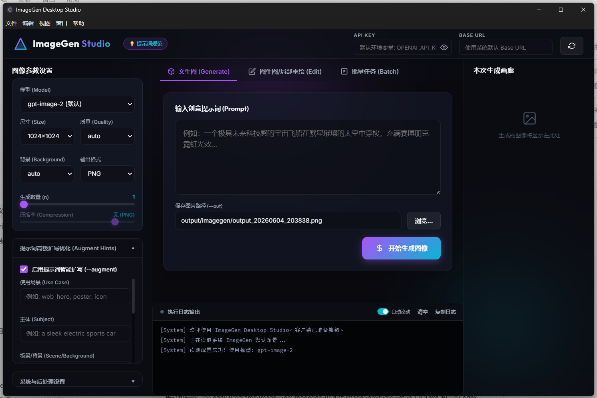
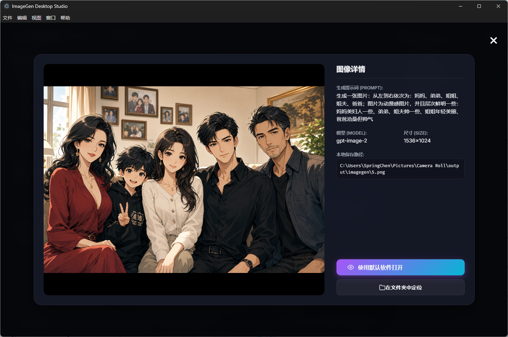

# ImageGen Studio

ImageGen Studio 是一个面向 Windows 的桌面图像生成工具，基于 Electron 提供图形界面，并通过内置 Python 脚本调用 OpenAI 兼容的图像生成接口。它支持文本生成图片、局部重绘、批量任务、输出预览和本地文件管理，适合日常创作、素材探索和图像工作流自动化。

## 界面预览





## 功能特点

- 文本生成图像：输入提示词，选择模型、尺寸、质量、背景和输出格式后直接生成。
- 局部重绘编辑：上传底图后使用画布涂抹蒙版，或选择外部蒙版文件进行局部编辑。
- 批量并发任务：支持 JSON Lines 批量任务，适合一次生成多组提示词。
- API 覆盖配置：可在界面中填写 API Key 和 Base URL，兼容 OpenAI 及兼容接口。
- 输出管理：生成完成后自动加载图片，可打开图片或定位到所在文件夹。
- Windows 安装包：支持标准安装器和绿色便携版。

## 下载

请在 GitHub Releases 中下载：

- `ImageGenStudio-Setup-1.0.3.exe`：标准安装版，安装时可自定义安装路径。
- `ImageGenStudio-1.0.3.exe`：绿色便携版，下载后直接运行。

## 使用方法

1. 启动 ImageGen Studio。
2. 在左上角的接口凭证区域填写 `OPENAI_API_KEY`。
3. 如使用第三方兼容接口，在 Base URL 中填写对应地址，例如 `https://example.com/v1`。
4. 选择模型、尺寸、质量和输出格式。
5. 输入提示词并选择保存路径。
6. 点击生成，等待任务完成后在右侧画廊查看结果。

## 本地开发

进入桌面端目录：

```powershell
cd imagegen-ui
```

安装依赖：

```powershell
npm install
```

启动开发版：

```powershell
npm start
```

构建 Windows 安装包和便携版：

```powershell
npm run dist
```

构建产物会输出到 `imagegen-ui/dist/`。

## 项目结构

```text
.
├── imagegen.ps1
├── imagegen-ui/
│   ├── main.js
│   ├── preload.js
│   ├── src/
│   ├── scripts/
│   ├── package.json
│   └── README.md
└── README.md
```

## 注意事项

- 请不要把真实 API Key 写入仓库文件。
- `node_modules/`、`dist/`、`python-embed/`、输出图片和临时文件已通过 `.gitignore` 排除。
- 若使用安装版，安装路径可以在安装向导中自行选择，不会强制安装到 C 盘。
